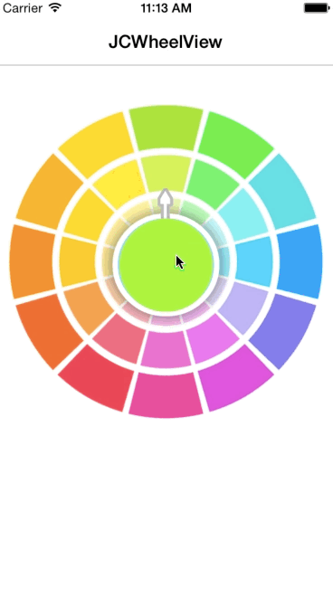

# JCWheelView

Support rotation and click event, Support replace image.  

 

## Installation

pod "JCWheelView"

## Usage

Refer to demo

## Author

[李京城](http://lijingcheng.github.io)

## License

MIT
